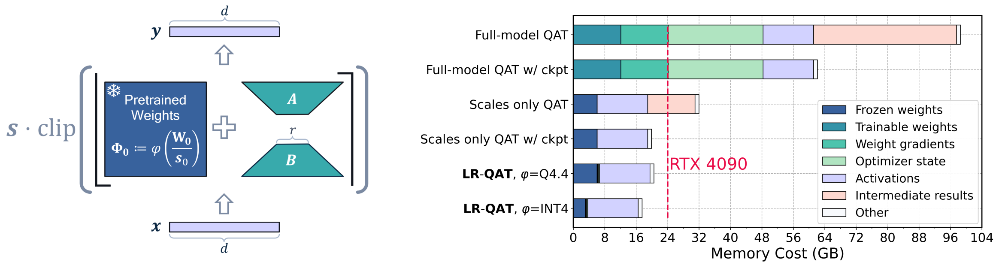
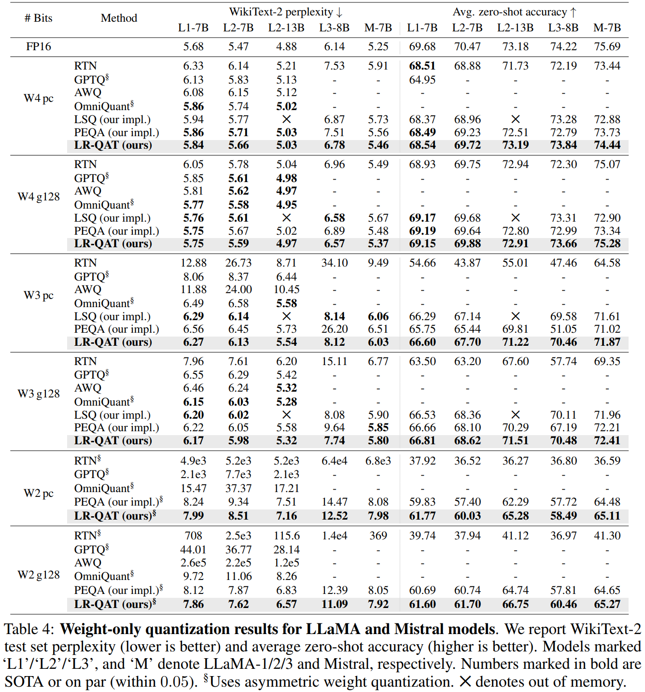
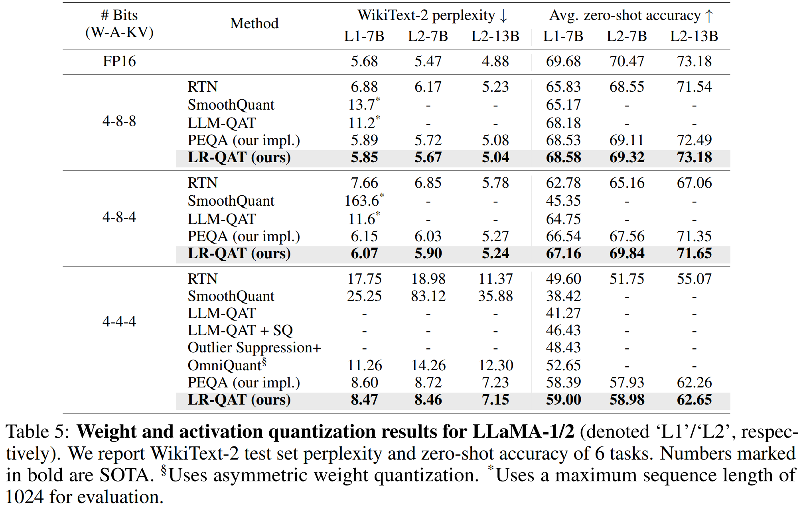

# Low-Rank Quantization-Aware Training for LLMs

This repository contains the implementation experiments for the paper presented in

**Yelysei Bondarenko<sup>1</sup>, Riccardo Del Chiaro<sup>1</sup>, Markus Nagel<sup>1</sup>, 
"Low-Rank Quantization-Aware Training for LLMs", NeurIPS 2024 submission.** [[ArXiv]](https://arxiv.org/abs/2406.06385)

<sup>1</sup> Qualcomm AI Research (Qualcomm AI Research is an initiative of Qualcomm Technologies, Inc.)


## Table of Contents:
- [Abstract](#abstract)
- [Results](#results)
  * [Weight-only quantization](#weight-only-quantization)
  * [Weight-activation quantization](#weight-activation-quantization)
- [Getting Started](#getting-started)
  * [Repository structure](#repository-structure)
  * [How to install](#how-to-install)
    + [with Docker (recommended)](#with-docker-recommended)
    + [without Docker](#without-docker)
  * [Models and datasets](#models-and-datasets)
- [Run commands](#run-commands)
  * [Example run command (Tiny-LLaMA)](#example-run-command-tiny-llama)
  * [Example run output (Tiny-LLaMA)](#example-run-output-tiny-llama)
  * [Reproducing results](#reproducing-results)
  * [Options](#options)
    + [Models](#models)
    + [Quantization settings](#quantization-settings)
  * [Result visualization](#result-visualization)
- [Citation](#citation)


## Abstract
<p align="center">
    
</p>

In this paper we propose **LR-QAT** -- a lightweight and memory-efficient QAT algorithm for LLMs. 
LR-QAT employs several components to save memory without sacrificing performance: _(a)_ low-rank quantization-aware reparameterization; _(b)_ downcasting operation using fixed-point or double-packing and _(c)_ checkpointing. 

Unlike most related work, our method **(i)** is inference-efficient, leading to no additional overhead compared to traditional PTQ; 
**(ii)** can be seen as a general extended pre-training framework, meaning that the resulting model can still be utilized for any downstream task afterwards; 
**(iii)** is orthogonal to most of recent PTQ methods and thus can be seamlessly combined with them. 

We apply LR-QAT to the LLaMA-1/2/3 and Mistral model families and validate its effectiveness on several downstream tasks. Our method outperforms most of recent LLM quantization approaches and reaches the same model performance as full-model QAT at the fraction of its memory usage. 
Specifically, we can train a 7B LLM on a single consumer grade GPU with 24GB memory.

## Results
### Weight-only quantization
<p align="center">
    
</p>

### Weight-activation quantization
<p align="center">
    
</p>

## Getting Started
### Repository structure
```bash
.
├── accelerate_configs  # HuggingFace accelerate configs
├── docker  # dockerfile and requirements files
├── img
├── lmeval  # LM eval code
├── models  # source code for quantized LLMs
├── quantization  # quantization tools and implementation of our methods
│   └── quantizers
├── utils
└── clm_main.py  # training/validating LLMs
```

### How to install
#### with Docker (recommended)
You can build and run the docker container as follows
```bash
docker build -f docker/Dockerfile --tag low_rank_qat:latest .
docker run -ti low_rank_qat:latest
```
Note that you might need to mount some directories (path to datasets) inside the docker container, and port mapping for accessing Tensorboard. 
You can add these options like so: `docker run ... -v /local/path/to/dataset:/app/dataset -p <PORT>:<PORT>`

#### without Docker
Set locale variables and add the project root directory to your pythonpath:
```bash
export LC_ALL=C.UTF-8
export LANG=C.UTF-8
export PYTHONPATH=${PYTHONPATH}:$(realpath "$PWD")
```

Make sure to have Python ≥3.6 (tested with Python 3.9.5) and 
ensure the latest version of `pip` (**tested** with 24.0):
```bash
pip install --upgrade --no-deps pip
``` 

Next, install PyTorch 1.13 with the appropriate CUDA version (tested with CUDA 11.7, CuDNN 8.5.0):
```bash
pip install torch==1.13.1+cu117
```

Install the remaining dependencies using pip:
```bash
pip install -r docker/requirements.txt
```

### Models and datasets
* The code expects a path to a pre-trained model checkpoint from HuggingFace & a path to a pre-tokenized [SlimPajama dataset](https://huggingface.co/datasets/cerebras/SlimPajama-627B).
* You can use other datasets like Wikipedia or Wikitext, for debugging, by specifying a different `--dataset-setup`. All non-SlimPajama datasets will be downloaded and tokenized automatically if not present in `--data-cache-dir`.


## Run commands
### Example run command (Tiny-LLaMA)
After the installation is complete, you can verify that the code is working as intended by running the following command that trains a Tiny-LLaMA for a few iterations
```bash
accelerate launch --config_file accelerate_configs/1gpu_no_mp.yaml clm_main.py train-quantized \
--weight-quant \
--per-channel \
--print-parameters \
--print-quant-ranges \
--with-tracking \
--no-eval-extra-datasets \
--learn-ranges \
--use-checkpointing \
--use-bf16 --use-bf16-ab \
--save-model \
--seed 1000 \
--dataset-setup wikitext_2 \
--num-workers 0 \
--data-cache-dir ~/.hf_data \
--validation-num-batches 8 \
--model-type llama \
--model-name-or-path TinyLlama/TinyLlama-1.1B-intermediate-step-1431k-3T \
--block-size 1024 \
--preprocessing-type join_nn \
--model-cache-dir ~/.hf_cache \
--learning-rate 5e-05 \
--beta2 0.95 \
--lr-scheduler-type linear \
--max-train-steps 2 \
--num-warmup-steps 1 \
--per-device-train-batch-size 1 \
--per-device-eval-batch-size 1 \
--gradient-accumulation-steps 1 \
--max-grad-norm 1.0 \
--weight-decay 0.0 \
--tqdm-update-interval 1 \
--eval-every-step 100 \
--qmethod symmetric_uniform \
--n-bits 4 \
--num-est-batches 1 \
--quant-setup FP_head_embd_norm \
--quant-scales-weight-decay 0.0 \
--lora-method lr_qat_fixed_point8 \
--lora-r 4 \
--lr-ab 0.001 \
--param-group lora_head_norm_embd \
--scales-lr 1e-05 \
--weight-quant-method current_minmax \
--act-quant \
--qmethod-act dynamic_asymmetric_uniform \
--act-quant-bits "a8" \
--output-dir tmp
```

### Example run output (Tiny-LLaMA)
```
INFO:CLM_main:LoRA fused: perplexity: 14.242778409807016 eval_loss: 2.65625                                                                           | 8/333 [00:03<02:23,  2.26it/s]
INFO:CLM_main:>>> Training done
INFO:CLM_main:>> Running train loss: 2.533
INFO:CLM_main:>> Total train time:. Elapsed time: 3.650 sec
INFO:CLM_main:>> Total eval time:. Elapsed time: 7.863 sec
```

### Reproducing results
Below is the run command for reproducing main results (W4 per-channel, LLaMA-1/2/3).
```bash
accelerate launch --config_file accelerate_configs/1gpu_bf16.yaml clm_main.py train-quantized \
--weight-quant \
--no-act-quant \
--per-channel \
--learn-ranges \
--use-bf16 \
--use-bf16-ab \
--use-checkpointing \
--seed 1000 \
--dataset-setup slimpajama_wiki \
--slimpajama-pretokenized-path "<PATH_TO_PRETOKENIZED_SLIMPAJAMA>" \
--data-cache-dir ~/.hf_data \
--validation-num-batches 512 \
--model-type llama \
--model-name-or-path "<PATH_TO_LLAMA_CHECKPOINT>" \
--block-size 1024 \
--model-cache-dir ~/.hf_cache \
--learning-rate 5e-05 \
--beta2 0.95 \
--lr-scheduler-type linear \
--max-train-steps 10000 \
--num-warmup-steps 1000 \
--eval-every-step 250 \
--per-device-train-batch-size 4 \
--per-device-eval-batch-size 1 \
--gradient-accumulation-steps 8 \
--max-grad-norm 1.0 \
--weight-decay 0.0 \
--qmethod symmetric_uniform \
--n-bits 4 \
--quant-setup FP_head_embd_norm \
--quant-scales-weight-decay 0 \
--lora-method lr_qat_fixed_point8 \
--lora-r 32 \
--lr-ab 0.001 \
--param-group lora \
--scales-lr 1e-05 \
--weight-quant-method LP_p4 \
--weight-opt-method grid \
--output-dir "<OUTPUT_DIR>"
```

### Options
#### Models
To run for Mistral model:
```bash
--model-type mistral
--model-name-or-path "<PATH_TO_MISTRAL_CHECKPOINT>"
```

#### Quantization settings
* to enable groupwise quantization:
```bash
--weight-quant-block-size 128
```
* to enable activation quantization, e.g. W4-A8:
```bash
--act-quant \
--qmethod-act dynamic_asymmetric_uniform \
--act-quant-bits "a8" \
```
* ... W4-A8-KV4:
```bash
--act-quant \
--qmethod-act dynamic_asymmetric_uniform \
--act-quant-bits "a8kv4"
```
* ... W4-A4:
```bash
--act-quant \
--qmethod-act dynamic_asymmetric_uniform \
--act-quant-bits "a4"
```
* to get PTQ baseline (RTN) results, you can run a training script with 0 iterations:
```bash
--learning-rate 0 \
--lr-ab 0  \
--max-train-steps 0  \
--num-warmup-steps 0 \
--per-device-train-batch-size 1 \
--per-device-eval-batch-size 1 \
--gradient-accumulation-steps 1 \
```

### Result visualization
The results and TensorBoard files are stored in the `--output-dir` location. 
To visualize these through Tensorboard run the following: `tensorboard logdir=<OUTPUT_DIR> host=<HOST_IP_ADDRESS>`


## Citation
If you find our work useful, please cite
```
@article{bondarenko2024low,
  title={Low-Rank Quantization-Aware Training for LLMs},
  author={Bondarenko, Yelysei and Del Chiaro, Riccardo and Nagel, Markus},
  journal={arXiv preprint arXiv:2406.06385},
  year={2024}
}
```
